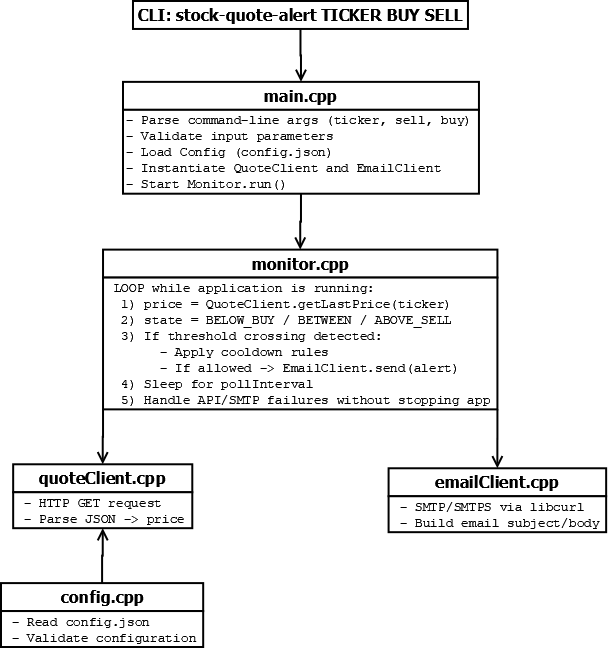

# Stock Quote Alert (B3)

Console application that monitors a B3 stock price and sends email alerts when the price goes above a sell threshold or below a buy threshold.

This repository is being developed as part of a technical challenge.

## Goal

- Monitor a single B3 ticker while the program is running
- Send a **SELL** alert when the price is **above** the sell reference
- Send a **BUY** alert when the price is **below** the buy reference
- Read email destination and SMTP settings from a configuration file
- Run as a console/CLI application

## CLI Usage (planned)

```bash
stock-quote-alert <TICKER> <SELL_PRICE> <BUY_PRICE>

# Example
stock-quote-alert PETR4 22.67 22.59
```

## Configuration (planned)

The application will read a JSON config file:

- Destination email for alerts
- SMTP server settings (host, port, credentials, TLS)
- Monitoring settings (poll interval, cooldown, etc.)

## High-Level Architecture



## Tech Stack (planned)

- C++ (console application)
- CMake
- libcurl (HTTP + SMTP)
- nlohmann/json (configuration and API response parsing)

## Notes

The quote provider will use the brapi.dev API (free tier). Depending on the plan limits, the polling interval may be adjusted.
